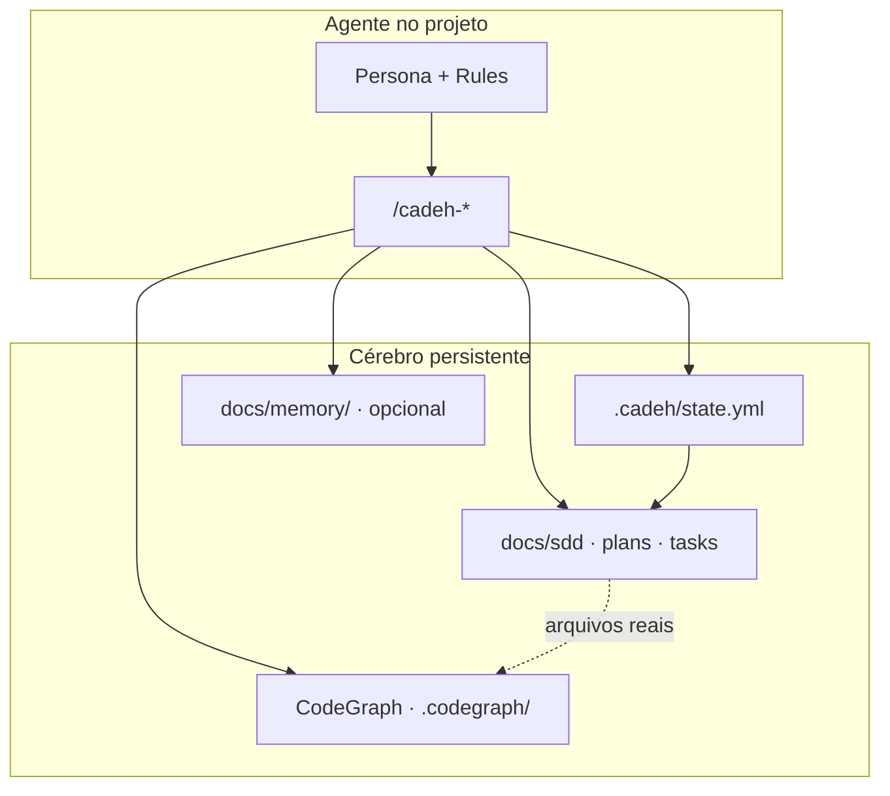

# Cérebro do CADEH — memória integrada

O CADEH não é uma coleção de arquivos soltos. É um **sistema de memória em camadas** que o agente deve usar **junto**, em toda sessão.

## Visão geral



| Camada | Onde | Pergunta | Quem atualiza |
|--------|------|----------|---------------|
| **Código** | CodeGraph (`.codegraph/` + MCP) | *Onde está? Quem chama? Qual o impacto?* | `cadeh codegraph index` / agente ao mudar código |
| **Fluxo** | `.cadeh/state.yml` | *Qual feature, fase, T-xx, próximo passo?* | Agente ao iniciar/encerrar sessão |
| **Especificação** | `docs/sdd/`, `docs/plans/`, `docs/tasks/` + skill **tlc-spec-driven** | *O quê, como, checklist?* | `/cadeh-spec`, `/cadeh-plan`, `/cadeh-tasks` |
| **Narrativa** | `docs/memory/<feature>.md` | *Decisões, bloqueios, contexto que não cabe no YAML* | `/cadeh-memory` (complementa state) |
| **Chat** | Thread atual | *Contexto imediato* | Some em chat novo — **não é fonte** |

## Regra de ouro

> **Novo chat = zero memória implícita.** O agente **reconstrói** o contexto lendo `state.yml` → docs da feature → CodeGraph → memória narrativa (se existir).

Comando de entrada: **`/cadeh-continue`** (ou `cadeh continue` no terminal).

## Orquestração inteligente (SDD)

O agente **não espera** o usuário lembrar a fase. Ele:

1. Lê `.cadeh/state.yml` (`feature`, `phase`, `task`).
2. Abre os docs correspondentes ao slug da feature.
3. Usa **CodeGraph** para qualquer pergunta sobre código (não grep em massa).
4. Executa o modo certo (entrevista vs implementação).
5. **Atualiza** `state.yml` e sugere o **próximo** comando `/cadeh-*`.

| `phase` | Comando principal | Próximo típico |
|---------|-------------------|----------------|
| *(vazio)* / `brief` | `/cadeh-spec` | SDD preenchido → `plan` |
| `sdd` | `/cadeh-spec` | SDD aprovado → `/cadeh-plan` |
| `plan` | `/cadeh-plan` | Plano aprovado → `/cadeh-tasks` |
| `tasks` | `/cadeh-tasks` | Tasks prontas → `/cadeh-implement` |
| `implement` | `/cadeh-implement` | T-xx feita → próxima T-xx ou `validate` |
| `validate` | checklist | feature concluída → limpar ou nova feature |

## Ciclo de uma sessão

### Início

```
/cadeh-continue
```

1. `.cadeh/state.yml`
2. `docs/sdd|plans|tasks/<feature>.md` se `feature` definida
3. `docs/memory/<feature>.md` se existir
4. CodeGraph: `codegraph_status` → `codegraph_context` ou `codegraph_search`
5. Resumo ≤10 linhas + *"Continuamos ou mudou o escopo?"*

### Durante

- **Spec / plan / tasks:** modo entrevista — perguntas, gravar Markdown, **sem código**.
- **Implement:** uma T-xx, `codegraph_impact` antes de editar.

### Fim

```
/cadeh-memory
```

Atualiza `state.yml` (`phase`, `task`, `notes`, `updated_at`) e append em `docs/memory/<feature>.md` (decisões, bloqueios, próximo passo).

## O que NÃO fazer

| Errado | Certo |
|--------|-------|
| Confiar no chat anterior | `/cadeh-continue` + arquivos |
| Adivinhar paths/símbolos | CodeGraph MCP |
| `memory.md` global único | `state.yml` + docs por feature |
| Substituir SDD por conversa | SDD/plan/tasks em `docs/` |
| Varrer o repo com grep | `codegraph_*` |

## CLI + Agente IA

```bash
cadeh init                        # + CodeGraph + TLC skill
cadeh new feature minha-feature   # + branch feature/<slug> + tasks com pré-requisitos
cadeh continue
```

SDD: processo **[tlc-spec-driven](https://github.com/tech-leads-club/agent-skills)** — ver `docs.cadeh/tlc-integration.md`.

No agente: `/cadeh-workflow` para o mapa completo.

## Hierarquia (conflito)

1. Pedido explícito do usuário **nesta** conversa
2. SDD da feature
3. Código (**CodeGraph** + leitura pontual)
4. Implementation Plan
5. Harness (persona + este documento)
6. Hipóteses da IA (sempre rotuladas)
