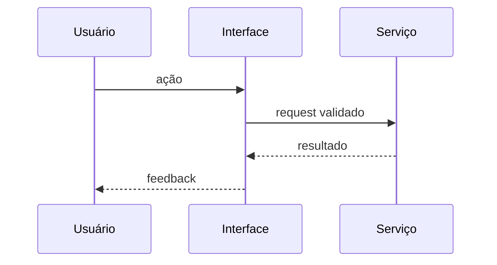

# Software Design Document (SDD)

> **Papel:** especificação do *o quê* — requisitos, escopo, arquitetura e contratos.  
> **Processo:** skill **tlc-spec-driven** → fase **Specify** ([tlc-integration.md](./tlc-integration.md), `references/specify.md`).  
> **Próximo passo:** derivar [implementation-plan.md](./implementation-plan.md) (TLC Design).  
> **Regras do agente:** [cadeh.md](./cadeh.md) · [cadeh.md](./cadeh.md)

**Feature / ID:** `[ex: AUTH-42]`  
**Status:** Rascunho | Em revisão | Aprovado  
**Última atualização:** `[data]`

---

## 1. Visão geral

### Nome do projeto / módulo
`[Nome]`

### Objetivo
Uma frase: o que o sistema ou funcionalidade deve resolver.

### Problema
Qual problema real está sendo resolvido?

### Resultado esperado
O que deve existir ao final da implementação (comportamento observável).

---

## 2. Escopo

### Dentro do escopo
- [ ] Item 1
- [ ] Item 2

### Fora do escopo
- [ ] Item que não será feito agora

### Restrições
Exemplos: sem novas deps sem justificativa; manter API pública; não alterar módulos não relacionados; compatibilidade com design system.

| Restrição | Origem |
|-----------|--------|
| [Ex: sem breaking change na API v1] | Negócio / técnica |

---

## 3. Usuários e casos de uso

### Usuário principal
Quem usa essa funcionalidade?

### Casos de uso

| ID | Como… | Quero… | Para… |
|----|-------|--------|-------|
| CU-01 | [persona] | [ação] | [benefício] |
| CU-02 | | | |

---

## 4. Requisitos funcionais

| ID | Requisito | Prioridade | Critério de aceite |
|----|-----------|------------|-------------------|
| RF-01 | [Descrição] | Alta | [Como validar] |
| RF-02 | [Descrição] | Média | |
| RF-03 | [Descrição] | Baixa | |

---

## 5. Requisitos não funcionais

| ID | Categoria | Expectativa |
|----|-----------|-------------|
| RNF-01 | Performance | [Ex: p95 < 200ms] |
| RNF-02 | Segurança | [Ex: auth obrigatória] |
| RNF-03 | Acessibilidade | [Ex: WCAG 2.1 AA] |
| RNF-04 | Manutenibilidade | [Ex: testes em camada X] |
| RNF-05 | UX/UI | [Ex: consistência com tokens do DS] |

---

## 6. Arquitetura proposta

### Resumo
Como a solução será organizada (camadas, módulos, integrações).

### Componentes

| Componente | Responsabilidade | Existe hoje? |
|------------|------------------|--------------|
| [Componente A] | [Responsabilidade] | Sim / Não / Parcial |
| [Componente B] | | |

### Fluxo principal

Ou lista numerada:

1. Usuário executa ação.
2. Interface valida entrada.
3. Serviço aplica regra de negócio.
4. Persistência / integração externa (se houver).
5. Resposta exibida ao usuário.

### Decisões arquiteturais (ADR leve)

| Decisão | Alternativas consideradas | Motivo da escolha |
|---------|---------------------------|-------------------|
| [Ex: usar Server Action] | REST route | [Motivo] |

---

## 7. Contratos de dados

### Entrada

| Campo | Tipo | Obrigatório | Validação |
|-------|------|-------------|-----------|
| | | | |

### Saída / modelo de domínio

| Campo | Tipo | Descrição |
|-------|------|-----------|
| | | |

### APIs / eventos (se aplicável)

| Método / Evento | Path / tópico | Request | Response | Erros |
|-----------------|---------------|---------|----------|-------|
| GET | `/api/...` | | | |

### Persistência (se aplicável)

| Entidade / tabela | Campos relevantes | Relações |
|-------------------|-------------------|----------|
| | | |

---

## 8. Interface e UX

### Telas / fluxos
- [ ] Tela ou componente A — [descrição]
- [ ] Estado vazio, loading, erro, sucesso

### Design system
Tokens, componentes ou padrões existentes a reutilizar: `[listar ou "confirmar no código"]`

---

## 9. Segurança e permissões

| Papel | Permissão |
|-------|-----------|
| | |

Dados sensíveis, auditoria, rate limit: `[especificar ou N/A]`

---

## 10. Testes e validação

| RF/RNF | Tipo de teste | Como validar |
|--------|---------------|--------------|
| RF-01 | Integração / E2E | |
| RNF-03 | A11y | |

Checklist pós-implementação: [validation-checklist.md](./validation-checklist.md)

---

## 11. Riscos e dependências

| Risco | Impacto | Mitigação |
|-------|---------|-----------|
| | Alto/Médio/Baixo | |

| Dependência externa | Status |
|--------------------|--------|
| [API, lib, time] | Disponível / Pendente |

---

## 12. Referências

- Código relacionado: `[paths]`
- Docs: `[links]`
- Issues: `[links]`
